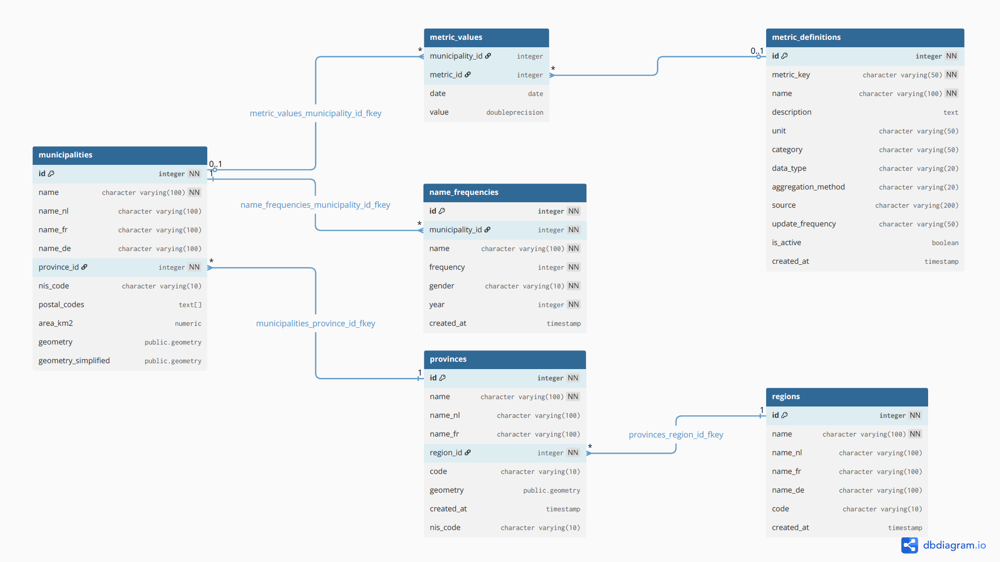

## Functionality

This application visualizes Belgian demographic data from 2025 including:

- **Population Density**: up until municipality-level
- **Popular Names**: most common names by gender, at all available levels. These are not the names of newborns, but reflects the entirety of the population.

## Data Sources (2025)

### [Statbel](https://statbel.fgov.be/nl)

- [REFNIS codes](https://statbel.fgov.be/nl/over-statbel/methodologie/classificaties/geografie) in .CSV format for all 565 municipalities, 10 provinces and 3 regions
- [First name frequencies](https://statbel.fgov.be/nl/open-data/voornamen-van-de-totale-bevolking-gemeente-15) in .xlsx format for all municipalities, for men and women with a threshold of five. This means that if a name occurs less than five times in a municipality, it's not in the database. This constitutes the bulk of the raw data at a total of 423,647 rows.
- [Population density](https://statbel.fgov.be/sites/default/files/files/documents/bevolking/5.11%20Bevolkingsdichtheid/Pop_density_nl.xlsx) for all municipalities from 2019–2025. Only 2025 data was ingested to match municipalities based on their NIS code (with recent mergers).

### [Open Data City of Brussels](https://opendata.brussels.be/pages/home/)

- [Spatial data of municipalities](https://opendata.brussels.be/explore/dataset/codes-ins-nis-postaux-belgique/export/?disjunctive.postal_code&disjunctive.refnis_code&disjunctive.gemeentenaam&disjunctive.nom_commune&disjunctive.code_ins_region&disjunctive.region_fr&disjunctive.region_nl&disjunctive.region_en) in .GeoJSON format with the WGS84 coordinate system (EPSG:4326) for the administrative boundaries.

All data are linked based on their Belgian NIS codes for 2025. In the original dataset 13 municipalities had missing geographic data due to their involvement in the 2025 mergers. This data has been appended on 17 February 2026. Their resolution might slightly differ (outlines of the choropleth map) , but the data should be sound. 
## Data Processing

- Population density calculated as people per km²  
- Name frequencies aggregated at municipal, provincial, regional, and national levels  
- Simplified geometries used for performance optimization. Full geometries constituted to severe delay and loading times, upwards of seconds. 

## Technical Details

Built with:

- **R Shiny** for the web application framework  
- **Leaflet** for interactive mapping  
- **PostgreSQL/PostGIS** for a responsive and robust data storage backbone, including storing spatial data  
- **sf** package for spatial operations  
- ** luwitemplate** package, for custom styling
- **Minisforum UN100P** mini computer with Ubuntu 24.04 LTS server as the hosting platform  
- **Shiny Server** for R application deployment  
- **Cloudflare Tunnel** to facilitate secure public hosting with this free service

## Database layout

